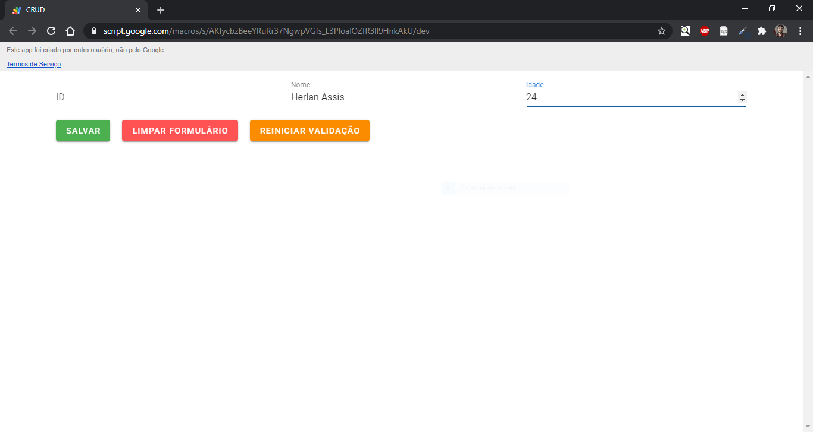
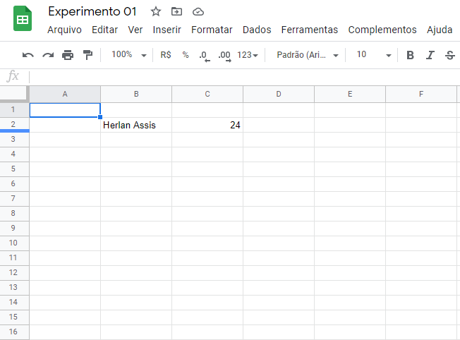

# GSheetsBaseCRUD


GSheetsBaseCRUD é uma `ferramenta/biblioteca` que permite `emular um banco de dados` com `planilhas do Google Sheets`. Com o uso desse projeto você será capaz de mapear colunas, criar, atualizar, listar, filter e deletar. Também é possível atribuir alguns restrições a coluna, como:

* tipo permitido ou lista de tipos permitidos
* array com validadores
* valor padrão
* se pode ser editado
* se pode ser escrito
* se é único
* se é obrigatório

Nesse projeto utilizei como exemplo uma aplicação Vue.jS via CDN para mostarar o potencial dessa ferramenta.

## Capturas de tela

Página web


Resultado após salvar o formulário



## Pré-requisitos
Antes de começar, verifique se você atendeu aos seguintes requisitos:

* Habilite o Google App Script dentro de uma planilha do Google;
* Habilite a execução de scripts para o seu projeto;

## Instalando GSheetsBaseCRUD
Para instalar o GSheetsBaseCRUD, siga estes passos:

** É de extrema importância que tudo seja executado na ordem!

1. Copie e cole todo o conteúdo do arquivo [base.js](./base.js);
2. Habilite às triggers/acionadores do [Google Sheets](https://developers.google.com/apps-script/guides/triggers/installable#managing_triggers_manually);

## Utilizando GSheetsBaseCRUD

Nesse exemplo, estarei inserindo em um arquivo único os seguintes elementos:
* Model;
* Controller;
* Api;
* Trigger Function;

Antes de tudo é necessário configurar a planilha, faça:
```javascript
const SHEET_URL = "<URL>";
const SHEET_NAME = "<Nome da planilha>"
```

Defina seu model:

```Javascript
class CarrinhoModel extends Model {}

// configuração da coluna que será utilizada como ID
CarrinhoModel.prototype.column_id = "ZZ"

CarrinhoModel.prototype.columns = [   
  {
    col: 'B',
    name: "nome", 
    type: String, 
    validators: [NotNullValidator, NotEmptyValidator],
    default: false,
    editable: true,
    writable: true,
    unique: false,
    required: true,
  },
  {
    col: 'C',
    name: "idade", 
    type: [Number, String], 
    validators: [NotNullValidator, NotEmptyValidator],
    default: 20,
    editable: true,
    writable: true,
    unique: false,
    required: true,
  }
]

// Triggers já implementadas
CarrinhoModel.prototype.triggers = [
  AddIdIfNotExist, OrderById
]
```

Agora o controller:
```javascript
/** YOUR CONTROLLERS */
class CarrinhoController extends Controller{}; 
/** YOUR CONTROLLERS */
```

Crie às instâncias de planilha, model, controller e api.
```javascript
const planilha = getSheetBy(SHEET_URL, SHEET_NAME);
const carrinhoModel = new CarrinhoModel(planilha);
const carrinhoController = new CarrinhoController(carrinhoModel);
const api = new API(carrinhoController);
```

A execução de triggers é habilitada pela configuração dos acionadores e pela função onEdit. Elas são habilidatas por `model`. Para habilitar faça:
```javascript
function onEdit(e){  
  carrinhoModel.runTriggers(e)
}
```

Como exemplo, fiz a chamada de métodos de um CRUD.
```javascript
async function create(params) {  
  return await api.create(params);
}

async function update(params) {  
  return await api.update(params);
}

async function list(params) {  
  let r = await api.filterOR({nome:'Teste', idade: 11});
  return r;
}

async function remove(params) {  
  let r = await api.remove(params);
  return r;
}
```

Por fim, criei uma página web simples
```html
<!DOCTYPE html>
<html>
  <head>
    <link href="https://fonts.googleapis.com/css?family=Roboto:100,300,400,500,700,900" rel="stylesheet">
    <link href="https://cdn.jsdelivr.net/npm/@mdi/font@4.x/css/materialdesignicons.min.css" rel="stylesheet">
    <link href="https://cdn.jsdelivr.net/npm/vuetify@2.x/dist/vuetify.min.css" rel="stylesheet">

    <script src="https://cdn.jsdelivr.net/npm/vue@2.x/dist/vue.js"></script>
    <script src="https://cdn.jsdelivr.net/npm/vuetify@2.x/dist/vuetify.js"></script>

    <meta name="viewport" content="width=device-width, initial-scale=1, maximum-scale=1, user-scalable=no, minimal-ui">
</head>

  <body>
      <div id="app">
        <v-app>
          <v-container>
            
            <v-alert
                :value="notification.alert"
                border="left"
                :color="notification.color"
                dark
            >
            {{ notification.message }}
            </v-alert>

            <v-form
              ref="form"
              v-model="form.valid"
            >
              <v-row>
                <v-col
                  cols="12"
                  md="4"
                >
                  <v-text-field
                    v-model.number="form.id"
                    label="ID"
                    type='number'
                  ></v-text-field>
                </v-col>

                <v-col
                  cols="12"
                  md="4"
                >
                  <v-text-field
                    v-model="form.nome"
                    label="Nome"
                    required
                  ></v-text-field>
                </v-col>

                <v-col
                  cols="12"
                  md="4"
                >
                  <v-text-field
                    v-model.number="form.idade"
                    label="Idade"
                    type="number"
                    required
                  ></v-text-field>
                </v-col>
              </v-row>
            </v-form>
      
            <v-btn
              color="success"
              class="mr-4"
              @click="save"
              :loading="loadings.saving"
              :disabled="loadings.saving"
            >
              Salvar
            </v-btn>

             <v-btn
              color="error"
              class="mr-4"
              @click="reset"
            >
              Limpar formulário
            </v-btn>

            <v-btn
              color="warning"
              @click="resetValidation"
            >
              Reiniciar validação
            </v-btn>
          </v-container>
        </v-app>
      </div>

      <script type="text/javascript">
          new Vue({
            el: '#app',
            vuetify: new Vuetify(),
            data: {              
              form: {
                valid: false,
                id: undefined,
                nome: undefined,
                idade: undefined,
              },
              loadings: {
                saving: false,
              },
              notification: {
                alert: false,
                message: "",
                color: ""
              }
            },
            methods:{
              validate() {
                return this.$refs.form.validate()
              },
              reset() {
                this.$refs.form.reset()
              },
              resetValidation() {
                this.$refs.form.resetValidation()
              },
              scriptRunAdapter(loadingName, callbackName, externalFunctionName, ...args){
                 if(this.loadings) this.loadings[loadingName] = true;

                 google.script.run.withSuccessHandler((e)=>{
                   if(this.loadings) this.loadings[loadingName] = false;
                   this[callbackName](e)
                 })
                 .withFailureHandler(()=>{
                   if(this.loadings) this.loadings[loadingName] = false;
                 })
                 [externalFunctionName](...args);
               },
              save(){                   
                  const {valid, ...data} = this.form                   
                 if(valid) {
                   this.scriptRunAdapter('saving', 'after', 'create', data)                    
                  }
              },
              after(promisse){                
                this.showAlert("Executado com sucesso")

                this.reset()
                this.resetValidation()
              },
              showAlert(message, color="light-green") {
                  this.notification.alert = true;
                  this.notification.message = message;
                  this.notification.color = color
                  
                  setTimeout(() => { 
                      this.notification.alert = false; 
                  }, 2000);
              },
            }
          });
      </script>    
  </body>
</html>
```

BÔNUS, para fazer deploy basta criar um novo arquivo com a função `doGet` e gerar uma nova implantação:
```javascript
function doGet() {
	let form = HtmlService.createTemplateFromFile("page")

	let mostrarForm = form.evaluate().setSandboxMode(HtmlService.SandboxMode.IFRAME);

	mostrarForm.setTitle("CRUD").setHeight(530).setWidth(800);

  return mostrarForm
}
```

No fim, minha árvore de arquivos ficou assim:
```
+--base.gs (código principal)
+--main.gs (criação de um CRUD de exemplo)
+--page.html (aplicação web)
+--bootstrap.gs (deploy atraves do método doGet)
```

## TODO

As próximas ações para o GSheetsBaseCRUD são:

* [x] ~~Escrever README~~
* [ ] Documentar Classes, métodos e funções utilizadas
* [ ] Escrever Testes

## Contribuindo para GSheetsBaseCRUD

Para contribuir com GSheetsBaseCRUD, siga estes passos:

1. Fork esse repositório.
2. Crie uma branch: `git checkout -b <branch_name>`.
3. Faça suas mudanças e comite para: `git commit -m '<commit_message>'`
4. Push para a branch de origem: `git push origin <nome_projeto>/<location>`
5. crie um pull request.

Como alternativa, consulte a documentação do GitHub em [criando uma pull request](https://help.github.com/pt/github/collaborating-with-issues-and-pull-requests/creating-a-pull-request).

Ou, me envie um e-mail com sugestões.

## Contribuidores

Agradeço às seguintes pessoas que contribuíram para este projeto:

* [@herlanassis](https://github.com/herlanassis)

## Contato

Se você quiser entrar em contato comigo, entre em contato com <herlanassis@gmail.com>.

## License
<!--- Se você não tiver certeza de qual licença aberta usar, consulte https://choosealicense.com --->
Este projeto usa a seguinte licença: [MIT License
](https://choosealicense.com/licenses/mit/).
